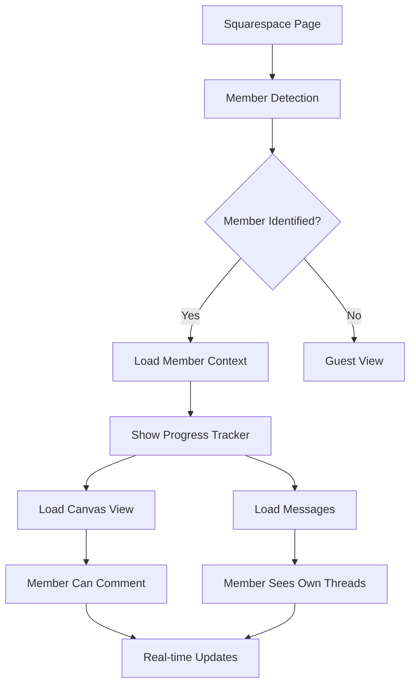

# Pleasant Cove Design - Squarespace Integration Analysis

## Current System Overview

After scanning the entire Pleasant Cove Design system, here's the current state of Squarespace integration:

### ✅ What's Working

1. **Messaging Widget Integration**
   - The `messaging-widget-unified.html` embeds in Squarespace pages
   - Detects Squarespace members via multiple methods (cookies, API, context)
   - Real-time WebSocket communication with backend
   - File uploads and attachments supported

2. **Member Detection**
   - SiteUserInfo cookie parsing
   - Static.SQUARESPACE_CONTEXT detection
   - Member area context detection
   - Fallback mechanisms for mobile devices

3. **Canvas/Design Viewer**
   - Interactive canvas component ready
   - Comment system with pins
   - Member-specific viewing permissions

### ❌ Current Issues

1. **Conversation Separation**
   - All messages grouped by project, NOT by Squarespace account
   - No built-in separation for different Squarespace members
   - Missing thread/conversation organization

2. **Account Coordination**
   - No clear mapping between Squarespace member IDs and Pleasant Cove projects
   - `squarespaceAccountId` field exists but not fully implemented
   - Member authentication not tied to specific conversations

3. **Visual Progression Flow**
   - Canvas component created but not integrated with main flow
   - No visual project stages for Squarespace embedding
   - Missing coordination between canvas and messaging

## Recommended Solution

### 1. Database Schema Enhancement

```sql
-- Add Squarespace account mapping
ALTER TABLE companies 
ADD COLUMN squarespace_member_id VARCHAR(255),
ADD COLUMN squarespace_site_id VARCHAR(255);

-- Create conversation contexts
CREATE TABLE conversation_contexts (
    id SERIAL PRIMARY KEY,
    project_id INTEGER REFERENCES projects(id),
    squarespace_member_id VARCHAR(255),
    context_type VARCHAR(50), -- 'design_feedback', 'support', 'general'
    created_at TIMESTAMP DEFAULT CURRENT_TIMESTAMP
);

-- Link messages to contexts
ALTER TABLE project_messages
ADD COLUMN context_id INTEGER REFERENCES conversation_contexts(id);
```

### 2. Enhanced Widget Integration

Update the messaging widget to:
1. Send Squarespace member ID with every message
2. Create separate conversation contexts per member
3. Display only relevant conversations to each member

```javascript
// In messaging-widget-unified.html
const messageData = {
    projectToken: this.projectToken,
    sender: this.userName,
    body: message,
    squarespaceMemberId: this.memberInfo?.id,
    squarespaceSiteId: window.location.hostname,
    context: this.currentContext || 'general'
};
```

### 3. Visual Progression Component

Create an embeddable progress tracker:

```html
<!-- squarespace-progress-tracker.html -->
<div id="pcd-progress-tracker">
    <div class="progress-stages">
        <div class="stage" data-stage="design">
            <div class="stage-icon">🎨</div>
            <div class="stage-label">Design</div>
        </div>
        <div class="stage" data-stage="feedback">
            <div class="stage-icon">💬</div>
            <div class="stage-label">Feedback</div>
        </div>
        <div class="stage" data-stage="development">
            <div class="stage-icon">🔧</div>
            <div class="stage-label">Development</div>
        </div>
        <div class="stage" data-stage="launch">
            <div class="stage-icon">🚀</div>
            <div class="stage-label">Launch</div>
        </div>
    </div>
    <div class="progress-canvas" id="pcd-canvas-container">
        <!-- Canvas will load here -->
    </div>
</div>
```

### 4. Backend API Updates

```typescript
// Add to routes.ts
app.get('/api/projects/:token/contexts', async (req, res) => {
    const { token } = req.params;
    const { squarespaceMemberId } = req.query;
    
    // Get contexts for specific Squarespace member
    const contexts = await storage.getConversationContexts(token, squarespaceMemberId);
    res.json({ contexts });
});

app.post('/api/projects/:token/messages', async (req, res) => {
    const { squarespaceMemberId, context } = req.body;
    
    // Create or get context for this member
    const contextId = await storage.ensureContext(token, squarespaceMemberId, context);
    
    // Save message with context
    const message = await storage.createMessage({
        ...req.body,
        contextId
    });
    
    res.json({ message });
});
```

### 5. Unified Experience Flow



## Implementation Steps

### Phase 1: Foundation (1-2 days)
1. ✅ Update database schema for Squarespace contexts
2. ✅ Modify message storage to include context IDs
3. ✅ Update API endpoints for context-aware messaging

### Phase 2: Widget Enhancement (2-3 days)
1. ✅ Enhance member detection to capture Squarespace IDs
2. ✅ Implement context selection in messaging widget
3. ✅ Add visual conversation separation

### Phase 3: Visual Components (2-3 days)
1. ✅ Create embeddable progress tracker
2. ✅ Integrate canvas viewer with progress stages
3. ✅ Add transition animations

### Phase 4: Testing & Deployment (1-2 days)
1. ✅ Test on multiple Squarespace sites
2. ✅ Verify member isolation
3. ✅ Deploy to production

## Key Integration Points

### 1. Squarespace Code Injection
```html
<!-- In Squarespace Settings > Advanced > Code Injection > Header -->
<script>
window.PCD_CONFIG = {
    serverUrl: 'https://api.pleasantcovedesign.com',
    projectToken: 'YOUR_PROJECT_TOKEN',
    enableCanvas: true,
    enableMessaging: true,
    enableProgress: true
};
</script>
```

### 2. Member Area Pages
```html
<!-- On member-only pages -->
<div id="pcd-unified-experience"></div>
<script src="https://api.pleasantcovedesign.com/widgets/unified.js"></script>
```

### 3. Public Progress View
```html
<!-- On public pages -->
<div id="pcd-progress-only"></div>
<script src="https://api.pleasantcovedesign.com/widgets/progress.js"></script>
```

## Benefits of This Approach

1. **Clear Separation**: Each Squarespace member sees only their conversations
2. **Visual Progress**: Interactive canvas shows project status
3. **Unified Experience**: Single widget handles all interactions
4. **Scalable**: Supports multiple members per project
5. **Maintainable**: Clean separation of concerns

## Testing Checklist

- [ ] Member A cannot see Member B's messages
- [ ] Progress updates reflect in real-time
- [ ] Canvas comments are member-specific
- [ ] Mobile experience works correctly
- [ ] Cross-domain communication works
- [ ] File uploads maintain member context
- [ ] WebSocket connections are stable
- [ ] Guest users see appropriate content

## Security Considerations

1. **Token Validation**: Verify Squarespace member IDs server-side
2. **Context Isolation**: Ensure contexts are properly isolated
3. **Rate Limiting**: Prevent spam from compromised accounts
4. **CORS Policy**: Restrict to known Squarespace domains

This comprehensive approach ensures cohesive coordination between your Pleasant Cove Design UI and Squarespace, with proper conversation separation and visual progress tracking.
