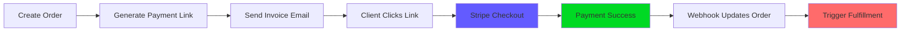

# 🔌 Stripe Integration Setup Guide

## ✅ **Current Status**
The Stripe integration is **fully implemented** and ready for configuration!

**Features implemented:**
- ✅ Payment link generation for orders
- ✅ Secure webhook signature verification 
- ✅ Automatic order status updates
- ✅ Fulfillment process automation
- ✅ Payment emails with secure links

---

## 🚀 **Quick Setup (5 minutes)**

### **1. Get Stripe API Keys**
1. Go to [Stripe Dashboard](https://dashboard.stripe.com/apikeys)
2. Copy your **Secret Key** (starts with `sk_test_...`)
3. Copy your **Publishable Key** (starts with `pk_test_...`)

### **2. Set Environment Variables**
Create a `.env` file in `pleasantcovedesign/server/`:

```bash
# Stripe Configuration
STRIPE_SECRET_KEY=sk_test_...your_secret_key_here...
STRIPE_WEBHOOK_SECRET=whsec_...your_webhook_secret...

# Payment URLs (customize for your domain)
STRIPE_SUCCESS_URL=https://pleasantcovedesign.com/payment/success
STRIPE_CANCEL_URL=https://pleasantcovedesign.com/payment/cancel

# Email (optional - for notifications)
SMTP_HOST=smtp.gmail.com
SMTP_PORT=587
SMTP_USER=billing@pleasantcovedesign.com
SMTP_PASS=your-app-password
```

### **3. Set Up Webhook Endpoint**
1. Go to [Stripe Webhooks](https://dashboard.stripe.com/webhooks)
2. Click **Add endpoint**
3. Enter URL: `https://your-domain.com/api/stripe/webhook`
4. Select events:
   - `checkout.session.completed`
   - `payment_intent.succeeded`
   - `payment_intent.payment_failed`
5. Copy the **Signing Secret** to `STRIPE_WEBHOOK_SECRET`

---

## 🧪 **Testing the Integration**

### **Development Testing:**
```bash
# 1. Start the server
cd pleasantcovedesign/server
npm start

# 2. Test order creation with payment link
curl -X POST http://localhost:3000/api/orders \
  -H "Content-Type: application/json" \
  -d '{
    "company_id": "1",
    "package": "growth",
    "addons": ["seo_package"]
  }'

# 3. Check the response for stripePaymentLinkUrl
```

### **Live Testing:**
1. Create a test order in the admin UI
2. Click "Send Invoice" 
3. Check console for payment link
4. Visit the payment link to test checkout
5. Use Stripe test card: `4242 4242 4242 4242`

---

## 💳 **Payment Flow**



---

## 🔧 **Configuration Options**

### **Payment Link Customization:**
Edit `pleasantcovedesign/server/stripe-config.ts`:

```typescript
// Customize payment options
const paymentLink = await stripe.paymentLinks.create({
  // ... existing config ...
  allow_promotion_codes: true,        // Enable discount codes
  billing_address_collection: 'required',  // Collect billing address
  shipping_address_collection: {      // Collect shipping for physical goods
    allowed_countries: ['US', 'CA']
  }
});
```

### **Package-Specific Products:**
The system automatically creates Stripe products for each order with metadata for tracking.

### **Email Templates:**
Customize email content in the `sendPaymentLinkEmail()` and `sendWelcomeEmail()` functions.

---

## 🛡️ **Security Features**

- ✅ **Webhook signature verification** prevents fake payment notifications
- ✅ **Metadata tracking** links payments to specific orders
- ✅ **Order validation** ensures payments match existing orders
- ✅ **Automatic status updates** prevent double-processing

---

## 📊 **Monitoring & Logs**

Check these logs for payment activity:
```bash
# Order creation with payment links
✅ Order created: ORD-20250126-ABCD1234
✅ Created Stripe payment link for order ORD-20250126-ABCD1234: https://buy.stripe.com/...

# Webhook processing
📨 Received verified Stripe webhook: checkout.session.completed
✅ Order ORD-20250126-ABCD1234 marked as paid (checkout completed)
🚀 Triggering fulfillment process for order ORD-20250126-ABCD1234
```

---

## 🚨 **Production Checklist**

- [ ] Replace test keys with live Stripe keys
- [ ] Set up live webhook endpoint with HTTPS
- [ ] Configure SMTP for email sending
- [ ] Set proper success/cancel URLs
- [ ] Test with real payment methods
- [ ] Monitor webhook delivery in Stripe dashboard

---

## 💡 **Next Steps**

1. **Test the current setup** with Stripe test mode
2. **Configure email sending** for production
3. **Customize payment success pages**
4. **Set up monitoring and alerts**
5. **Add customer portal** for subscription management

---

## 🆘 **Troubleshooting**

### **Payment Link Not Generated:**
- Check `STRIPE_SECRET_KEY` is set correctly
- Verify Stripe package is installed: `npm list stripe`
- Check server logs for Stripe errors

### **Webhook Not Working:**
- Verify webhook URL is accessible
- Check `STRIPE_WEBHOOK_SECRET` matches Stripe dashboard
- Ensure webhook events are selected in Stripe dashboard

### **Order Not Updating:**
- Check webhook signature verification passes
- Verify order ID in webhook metadata
- Check database for order existence

---

**🎉 Your Stripe integration is ready! The system will now:**
- Generate secure payment links for all orders
- Process payments automatically  
- Update order status in real-time
- Trigger fulfillment when payments complete
- Send welcome emails to clients

**Ready to start collecting payments!** 💰 